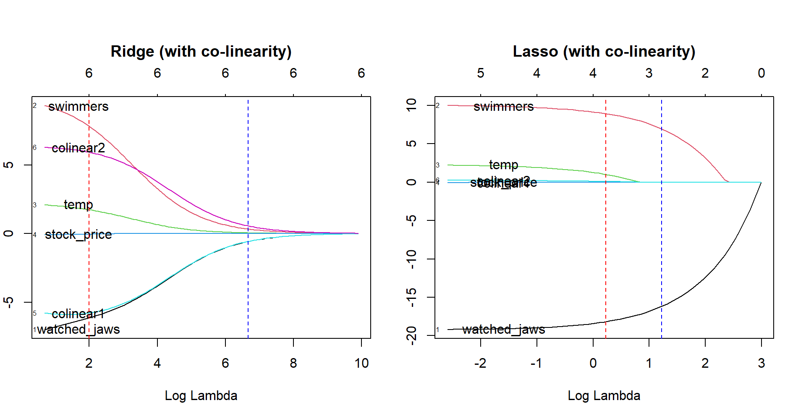
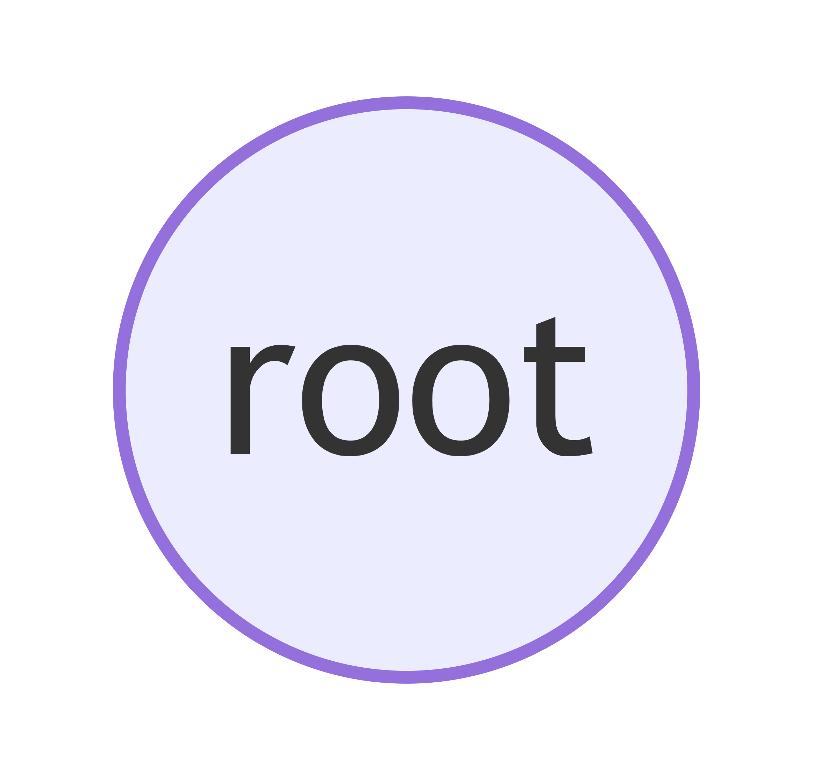
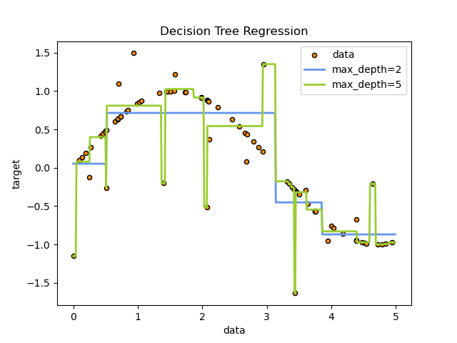

# Machine Learning Workshop

---
# Introduction

<h3>Jelmer Offenberg</h3>

Lead Machine Learning Engineer @ Albert Heijn
Trainer @ Ainomic

--- 
# Agenda
- Scope of today
- Theory on a selected group of ML algorithms
- Model metrics and evaluation

---

<h3>Warning - ML Lingo incoming..<h3>

---
# Scope
Today your scope will consist of:
- Understanding the process of model development
- Supervised learning
    - A **regression** task
    - A **classification** task
- Traditional algorithms that are effective in practice
    - **Tree-based** models
    - **Linear** models
- Two prepared datasets
    - You can focus on the important concepts without spending lots of time on data preparation

---
# How much can you do in a day?
We only have:
- one day;
- limited mental bandwith;
- a long lunch break.

So we will only scratch the surface of some topics. My goal is that by the end of the day you understand the model development lifecycle and have done this once or twice yourself.

**We will touch a bit upon the math of some models, this helps to build fundamental understanding.**

---
# What is Machine Learning

In machine learning, the goal is to learn patterns from data that allows us to make predictions or decisions on new/unseen cases.

---
# Terminology
- **features**: also known as explanatory variables, input data, feature vectors, **X**. The datapoints you feed to a model.
- **target**: also known as target variable, label, **y**.
- **metrics**: a calculation that says something about how good a model is.
- **cost function**: can be the same as a metric, but this is used to train a model.
- **training**: also known as model fitting, the process of learning patterns from the data.
- **prediction**: also known as inference, the process of creating predictions using a trained model
- **evaluation**: how well is a model performing, this is evaluated via strict principles (more later)

--- 
# Model development cycle

---
# Supervised Learning
Supervised learning attempts to learn patterns from data by using example labeled data. For instance:
- forecasting sales per day based on historical sales
- predicting if a customer will churn
- predicting the next word in a sequence (e.g. large language models)

---
# Unsupervised Learning
Discovering patterns in data without any labeled outputs. For instance clustering of datapoints.
- Customer segmentation

---

---

<h3>Questions?</h3>

---
# Models (for todays scope)
- Linear Regression (Ridge & Lasso variants)
- Logistic Regression
- Decision Tree
- Random Forest
- Gradient Boosted Trees

---
# Linear Regression (ridge)

---
# Linear Regression (ridge)

---
# Linear Regression (Ordinary Least Squares)
To put it simple, we want to find a line to fit the data that minimizes the sum of the residual squares. This is the cost function.

---
# Linear Regression (ridge)

Question:
- What would be the problemtic with having many regression coefficients?
- What could be the problematic with having a coefficient with a very large value?

---
# Regularization

To mitigate the problems with the coefficients discussed before, there is a technique called regularization. To understand this, we need to discuss the bias-variance trade-off.

---
# Underfitting

- Model is too simple so it can’t capture the patterns.
- Example: fitting a straight line to a wiggly curve.
- Bad on training data and test data.
- We call this having a high bias

---
# Overfitting
- Model is too complex, memorizes training data.
- Looks perfect on training set, but fails on new data.
- Example: a wiggly line passing exactly through every point.
- This model has a high variance

---
# Bias-variance trade-off

High bias means that there are wrong assumptions in the model. High variance means that the model is too sensitive. The balance is the sweet spot.

---
# Bias-variance trade-off

---
# Regularization
A way to control model complexity.

- Adds a penalty for overly large coefficients (or overly deep trees).
- Forces the model to keep it simple unless the data really demands it.

---

<h3>Back to ridge and lasso resgression..</h3>

---
# Ridge Regression

---

# Lasso Regression

---
# The impact of both regularization methods

---

<h1>Time for a short break, but first, any questions?</h3>

---
# Tree-based models

Before the break we discussed:
- a traditional linear regression
- overfitting, underfitting
- regularization

Overfitting, underfitting, regularization, these things are applicable to any model. So we bring this knowledge into the domain of tree-based models.

---
# Tree-based models
We'll discuss three algorithms in this section
- Decision trees
- Random forest
- Gradient boosted trees

These all build on top of the same principle, but with improvements.

---
# Decision Trees (DT)
- Simple to understand and interpret
- Works for classification and regression
- Works with all types of variables, even missing values
- Needs little preprocessing to work

---
# Decision Trees (DT)

---
# How do DTs work?

Trees are build as follows:
- Start at the root node
- Decide which feature to split on
- Build the tree step by step until you've reach the **max depth**
- New datapoints are ran through the tree to obtain a prediction

---
Construct the root node

---
Create the first branches

---
Branch further until we've reached the leafs of the tree

---
# Visualisations of decision tree classification

---
# Visualisation of a decision tree regression

---
# How is decided which feature to split on?
**You want to split on conditions that give you the most information about the target variable.**
- For this the information gain is calculated
- This is done using *Entropy* or *Gini Index*
- I'll explain this using a simple example

---
# Information Gain

---
# Parameters and tuning
- Max Depth
- Min Samples per Split
- Min Samples per Leaf
- Max Features

---
# The problem with DTs?
- Easy to overfit
- Can be quite unstable and sensitive to datapoints
- If the dataset is unbalanced, you might run into problems
- Can be hard to tune

---

<h1>Questions?</h3>

---

<h1>The evolution of tree-based models</h3>

---
# Ensemble models
- Instead of one model, use a group of models
- The idea is that multiple models predict an outcome, and then they vote on the result. The majority vote will be the prediction. A bit like democracy.

---
# Random Forest (bagging)
We create many decision trees in one go, but with a caveat:
- Each tree is trained on a bootstrapped subset of data
- Each tree is trained on a random subset of features
- By creating imperfect trees, we achieve a better result and are resilient to overfitting

---
# Boosting (XGBoost, LightGBM)
We build one tree after the other and each tree tries to fix the mistakes of the previous one
- Errors get extra weight in the next iteration of training, so the model learns from them
- If you keep on training, the model might overfit, for this we use a technique called **early stopping**

---

<h1>Time for a short break, but first: any questions?</h3>

---

<h1>Model Evaluation</h3>

---
# Model Evaluation
At some point you'd like to understand how well your model performs. Are you overfitting, underfitting? What is the performance on your metric like?

---
# Model evaluation metrics
We've already touched upon a few metrics, these are a few that are often used.

**For regression:**
- **Mean Absolute Error**: the average absolute difference.
- **Root Mean Squared Error**: comparable to MAE, but punishes larger mistakes.

**For classification:**
- **Precision**: of the positive predictions, how many were correct?
- **Recall**: of the actual positive predictions, how many did we find?
- **F1-Score**: weighs precision and recall in one metric.

---
# Model evaluation metrics (MAE)

---
# Model evaluation metrics (RSME)

---
# Model evaluation metrics (Precision, Recall)

---
# Model evaluation (F1-Score)

---
# Feature Importance (tree-based models)

---
# Splitting data for testing
For testing, we typically split our data into train and test sets. This way you can test if your model really learned patterns or just memorized the training data.

- Train on one part of the data.
- Test on another, unseen part.
- If test performance is good, the model generalizes well.

---
# Train-test split
- Simple: divide data once (e.g. 80% train, 20% test).
- Train model on the 80%, evaluate on the 20%.
- Problem: results may depend on which 20% you picked.

---

---
# Cross-validation
- Split data into **K** folds (e.g. 5).
- Train on 4 folds, test on 1. Repeat until each fold was test once.
- Average the scores, this gives a more reliable estimate.
- Requires **K** runs, which can be expensive if training takes a long time.

---

---
# The holdout set
We typically have another bit of data (let's say 20%) that we don't use until we've finalised the model. This data is called the holdout set.

---

<h1>Finally, time for the hands-on part of the day!</h3>

---
# Assignment: predict house prices in California
This dataset is cleaned and available in _scikit-learn_, Python's ML library. We will use this to get comfortable with the basics. 

- **goal**: familiarize yourself with model development, experiment with different modeling techniques and evaluation methods.
- **goal**: what mean absolute error can you get with your model? Let's make a little competition.
- **constraint**: minimise usage of ChatGPT for solving the problem, only use it to explain bits of code or brainstorm.
---
# Assignment: predict if bank customers will take a term deposit
- **goal**: familiarize yourself with model development on a larger dataset aimed at classification
- **goal**: what is the best score you can get with your model? Let's make a little competition.
- **goal**: can you find the optimal set of parameters for a model using a grid search or random search approach?
